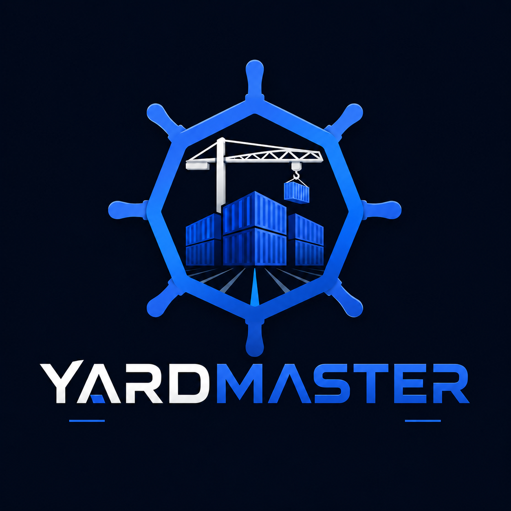
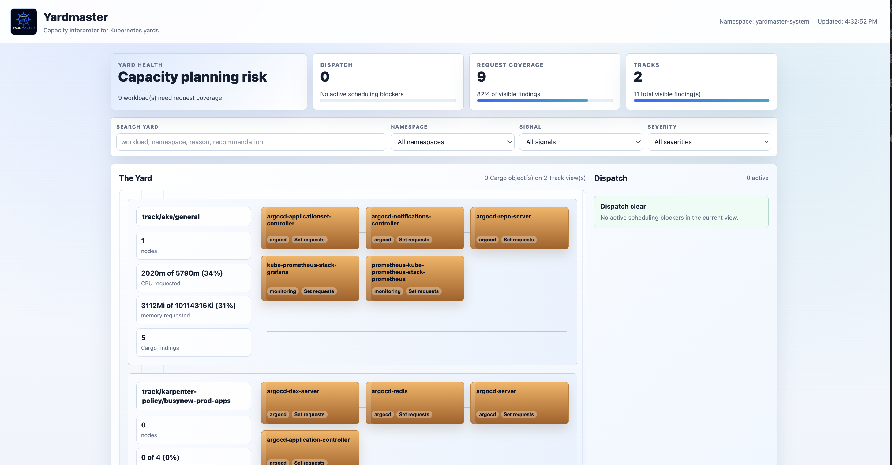
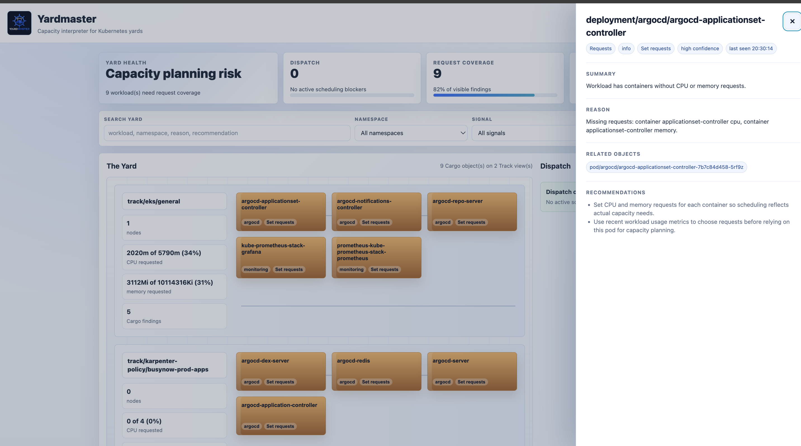
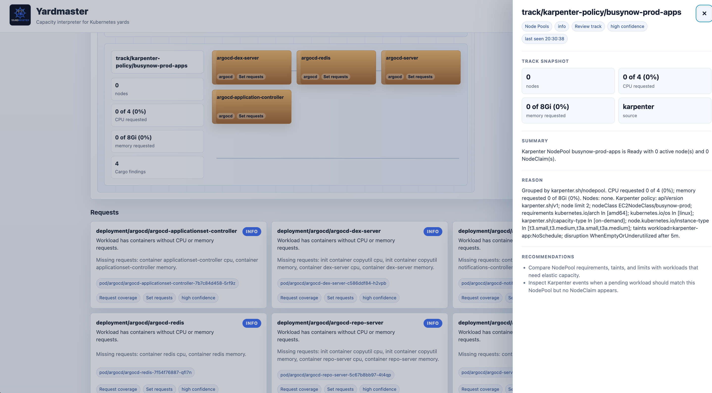
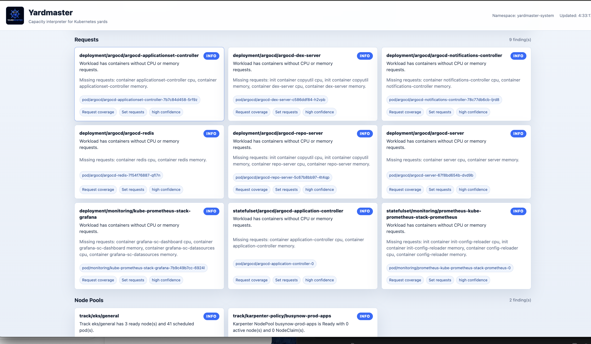

# Yardmaster

<div align="center">



# Yardmaster
Capacity intelligence for Kubernetes yards.

</div>

Yardmaster is a Kubernetes capacity interpreter. It watches workloads, nodes, events, and capacity groups, then turns raw cluster state into clear operational findings.

Kubernetes can tell you that a pod is pending. Karpenter can decide whether new nodes should exist. Yardmaster explains the capacity story around those signals:

- what is blocked
- what workload owns the problem
- which Track of capacity is involved
- whether requests, labels, taints, or node pool shape are contributing
- what an operator checks or changes next

Yardmaster is advisory by design. It does not provision nodes, mutate workloads, or replace Karpenter. It gives platform teams a readable layer between scheduler symptoms and capacity decisions.

## Dashboard Preview



The dashboard opens with an operator view of the cluster: yard health, dispatch blockers, request coverage, track count, filters, and the current capacity yard.



The Yard view maps cluster capacity into Tracks, Cargo, and Dispatch so operators can see where workloads are landing and which capacity groups are carrying risk.



The detail drawer keeps the operator path concrete: workload owner, related pod, reason, recommendations, and confidence in one place.



Karpenter-aware Track details expose NodePool readiness, limits, requirements, taints, disruption policy, and NodeClaim state beside the workloads using that capacity path.

## What It Does

Yardmaster currently runs as a Kubernetes controller, a `kubectl`-style CLI, and a local or in-cluster dashboard.

It can:

- detect pending workloads and explain likely scheduling blockers
- identify containers missing CPU or memory requests
- group ready nodes into capacity Tracks using common node pool labels
- summarize requested versus allocatable CPU and memory by Track
- read Karpenter NodePools and NodeClaims to expose elastic capacity policy as Track findings
- resolve pod findings back to owner workloads such as Deployments, StatefulSets, DaemonSets, Jobs, and CronJobs
- write findings as `DispatchFinding` custom resources
- show findings in the CLI and dashboard as Yard, Track, Cargo, and Dispatch objects

The current controller writes only Yardmaster-owned CRDs. It reads cluster state and emits explanations.

## Core Concepts

### Yard

A Yard is the Kubernetes capacity surface Yardmaster watches. In the current implementation, a Yard maps to one Kubernetes cluster.

### Track

A Track is a pool of capacity. Yardmaster groups nodes into Tracks using labels such as:

- `karpenter.sh/nodepool`
- `eks.amazonaws.com/nodegroup`
- `cloud.google.com/gke-nodepool`
- `kubernetes.azure.com/agentpool`
- fallback shape labels such as instance type, zone, OS, and architecture

Tracks help answer: "Where is capacity available, and what kind of workloads is it serving?"

### Cargo

Cargo is the workload that needs capacity. Yardmaster promotes pod-level findings to the owning workload when possible:

- Deployment
- StatefulSet
- DaemonSet
- Job
- CronJob
- Pod fallback when no owner is available

This keeps reports useful at the level humans operate: app or workload first, exact pod second.

### Dispatch

Dispatch is the scheduling or capacity guidance Yardmaster produces.

Examples:

- "This workload cannot schedule because no ready node matches its selector."
- "This Deployment has containers without CPU or memory requests."
- "This Track has 3 ready nodes and 42 scheduled pods."
- "This workload is blocked by untolerated taints."

## Architecture

```text
Kubernetes API
      |
      v
Yardmaster Controller
      |
      +--> Pending workload analyzer
      +--> Request coverage analyzer
      +--> Track summary analyzer
      |
      v
DispatchFinding CRDs
      |
      +--> kubectl-yardmaster report
      +--> Yardmaster dashboard
```

The controller watches core Kubernetes resources and periodically reconciles findings. Findings live in the `yardmaster-system` namespace by default.

## DispatchFinding

`DispatchFinding` is the main Yardmaster API object. It represents one scheduling, capacity, or workload-configuration finding.

Example:

```yaml
apiVersion: yardmaster.dev/v1alpha1
kind: DispatchFinding
metadata:
  name: requests-pod-default-api-6f775cf4f6-x87rv
  namespace: yardmaster-system
spec:
  severity: info
  category: requests
  subject:
    apiVersion: apps/v1
    kind: Deployment
    namespace: default
    name: api
  related:
    - apiVersion: v1
      kind: Pod
      namespace: default
      name: api-6f775cf4f6-x87rv
  summary: Workload has containers without CPU or memory requests.
  detail: "Missing requests: container api cpu, container api memory."
  recommendations:
    - Set CPU and memory requests for each container so scheduling reflects actual capacity needs.
    - Use recent workload usage metrics to choose requests before relying on this pod for capacity planning.
status:
  firstSeen: "2026-06-06T19:31:13Z"
  lastSeen: "2026-06-06T19:31:13Z"
```

The `subject` is the object Yardmaster wants the operator to think about. The `related` list preserves the lower-level Kubernetes objects involved in the finding.

## CLI

Build the binaries:

```bash
make build
```

Print a readable report:

```bash
bin/kubectl-yardmaster --finding-namespace=yardmaster-system report
```

Example output:

```text
Yardmaster report from namespace yardmaster-system

Scheduling
  warning  deployment/default/worker
           Workload cannot schedule on any ready node because its node selector does not match.
           Reason: No ready schedulable nodes match nodeSelector terms: workload=batch.
           Related: pod/default/worker-77bc9c94d6-zxk8p
           Recommendation: Add compatible node capacity with the required labels.
           Recommendation: Relax the nodeSelector if it is no longer required.

Requests
  info     deployment/default/api
           Workload has containers without CPU or memory requests.
           Reason: Missing requests: container api cpu, container api memory.
           Related: pod/default/api-6f775cf4f6-x87rv
           Recommendation: Set CPU and memory requests for each container so scheduling reflects actual capacity needs.
```

## Dashboard

Run the local dashboard:

```bash
make dashboard
```

Open:

```text
http://localhost:8088
```

The dashboard renders the cluster as a Yard:

- Tracks are capacity lanes.
- Cargo blocks are workload findings.
- Dispatch cards are active scheduling blockers.
- Finding cards show grouped details.

Cargo, Dispatch, Track labels, and finding cards are clickable. The detail drawer shows summary, reason, severity, related pods, and recommendations.

For an in-cluster dashboard:

```bash
make dashboard-port-forward
```

Then open `http://localhost:8088`.

## Local Development

Required tools:

- Go
- Docker
- `kubectl`
- `kind`
- `kustomize`

Run tests and build:

```bash
make test
make build
```

Run a self-contained local smoke test:

```bash
make smoke-kind
```

The local demo path uses a `kind` cluster named `yardmaster`. Demo targets now switch to and/or require the `kind-yardmaster` context before creating sample pods or labeling nodes.

The protected demo targets are:

```bash
make sample
make smoke-kind
make demo-kind
```

These targets are for local `kind` development only. They create sample pods and label demo nodes so Track grouping is visible.

## Deploying To A Cluster

Build and publish an image:

```bash
make docker-build IMG=<registry>/yardmaster:<tag>
docker push <registry>/yardmaster:<tag>
```

Deploy:

```bash
make deploy IMG=<registry>/yardmaster:<tag>
```

Wait for rollout:

```bash
kubectl -n yardmaster-system rollout status deployment/yardmaster
kubectl -n yardmaster-system rollout status deployment/yardmaster-dashboard
```

Open the dashboard locally:

```bash
make dashboard-port-forward
```

Before running Yardmaster against a real cluster, read [docs/prod-demo.md](docs/prod-demo.md).

Do not run demo/sample targets against a real cluster. They are guarded now, but the intended real-cluster path is `make deploy`, not `make sample`, `make smoke-kind`, or `make demo-kind`.

## Relationship To Karpenter

Karpenter is a node provisioning and disruption system. It decides what capacity should exist so workloads can run.

Yardmaster is an interpretation layer around capacity and scheduling state. It explains:

- why a workload is hard to place
- whether requests make scheduling unreliable
- which Track is serving current workloads
- which labels, taints, or selectors are blocking placement
- where to inspect Karpenter, node groups, or workload constraints next

The two tools are complementary. Karpenter changes capacity. Yardmaster explains capacity decisions.

Future Karpenter-aware work includes:

- reading `NodePool` and `NodeClaim` resources
- explaining Karpenter provisioning failures
- detecting conflicts between workload constraints and NodePool requirements
- recommending NodePool or workload changes

## Design Principles

- Explain before automating.
- Prefer concrete findings over opaque scores.
- Keep recommendations traceable to Kubernetes state.
- Work without cloud credentials.
- Integrate with Karpenter instead of competing with it.
- Keep permissions limited to reading cluster state and writing Yardmaster findings.
- Make the CLI and dashboard useful to operators during real incidents.

## Development Direction

Near-term work:

- richer dashboard drilldowns for related Kubernetes objects
- Karpenter `NodePool` and `NodeClaim` awareness
- namespace and workload filters
- owner/team attribution
- release automation and versioned images
- Helm or another clean install path once the deployment surface stabilizes

Longer-term work:

- Prometheus or metrics-server integration for request tuning
- disruption and consolidation analysis
- scheduled workload capacity forecasting
- explicitly configured remediation policies

## Name

A yardmaster coordinates movement and capacity in a rail yard. Yardmaster applies that operating model to Kubernetes: workloads are Cargo, node pools are Tracks, and scheduling pressure is the Dispatch problem.

The name is practical, operational, and a little memorable. That is the point.
