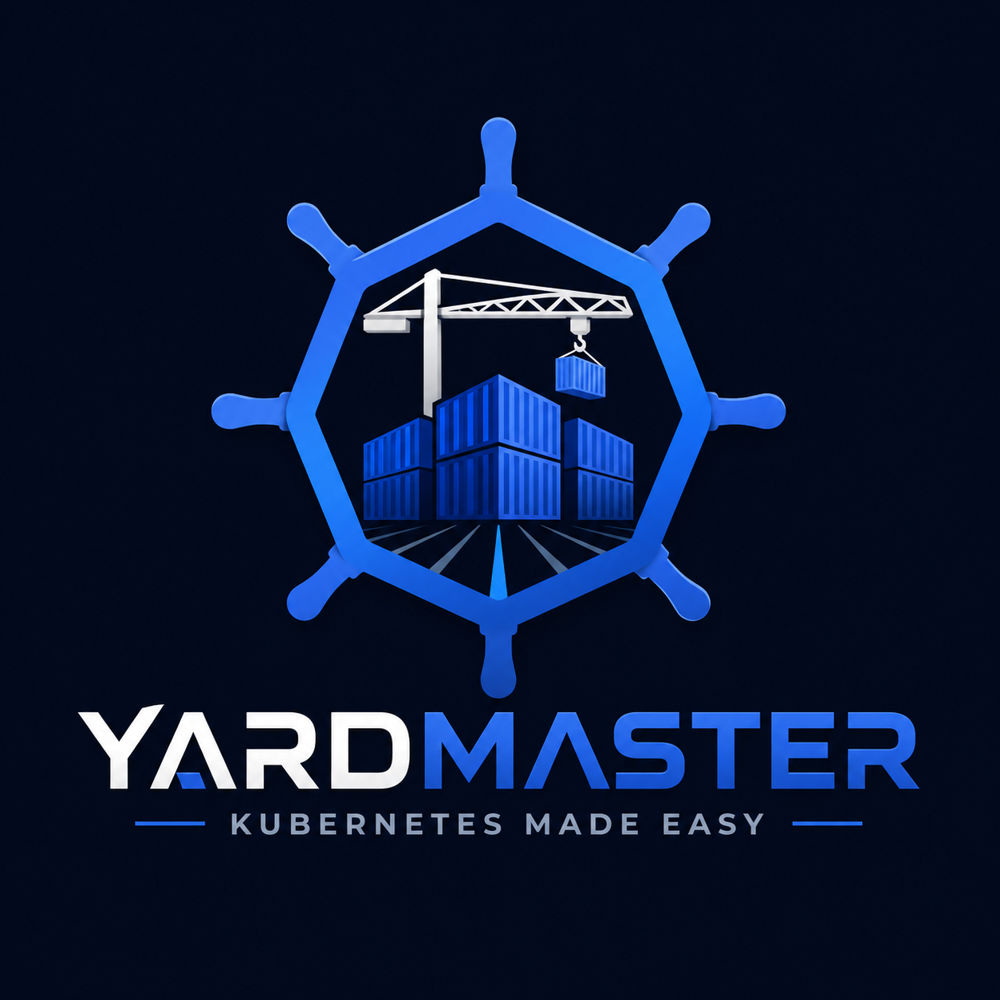

# Yardmaster

<div align="center">



# Yardmaster
Declarative Kubernetes environment and workload management.

</div>

Yardmaster is a Kubernetes add-on for understanding, explaining, and improving cluster capacity decisions.

Karpenter answers: "What nodes should exist right now so pending pods can run?"

Yardmaster answers: "Why is capacity unhealthy, what will happen next, and what should we change before it hurts?"

The first version should be a practical Kubernetes controller and CLI that watches workloads, pods, nodes, events, and autoscaling signals, then produces clear recommendations about scheduling pressure, waste, risky disruption, and node pool fit.

## Vision

Kubernetes gives teams a huge amount of state, but very little narrative.

When workloads are pending, over-provisioned, stuck behind pod disruption budgets, or packed onto the wrong node shapes, operators usually have to stitch together answers from `kubectl describe`, cloud consoles, metrics dashboards, events, and tribal knowledge.

Yardmaster should become the cluster's capacity interpreter:

- explain why pods are pending
- identify underused or poorly shaped node pools
- detect workloads that cannot safely move
- recommend better requests, limits, tolerations, affinities, and node pool shapes
- forecast predictable capacity pressure from cron jobs or scheduled workloads
- optionally apply safe, explicitly configured remediations

The tool should start as advisory. Automation can come later.

## Core Concepts

### Yard

A Yard represents the capacity surface Yardmaster watches. In early versions, this can simply mean one Kubernetes cluster.

Later, a Yard could describe a logical tenant, environment, namespace group, or fleet of clusters.

### Track

A Track represents a pool of capacity, usually a Kubernetes node pool, Karpenter NodePool, managed node group, or autoscaling group.

Yardmaster should reason about each Track's:

- instance families or node shapes
- labels and taints
- zones
- allocatable CPU, memory, pods, GPUs, and ephemeral storage
- utilization
- pending workload compatibility
- disruption and consolidation risk

### Cargo

Cargo represents workloads that need capacity:

- Pods
- Deployments
- StatefulSets
- DaemonSets
- Jobs
- CronJobs

Yardmaster should inspect Cargo requests, limits, placement constraints, priority, disruption budgets, restart behavior, and scheduling failures.

### Dispatch

A Dispatch is Yardmaster's recommendation.

Examples:

- "This pod is pending because all compatible nodes are blocked by taints."
- "This namespace requests 96 CPU but uses 11 CPU at p95 over 7 days."
- "This node pool cannot consolidate because three workloads have strict zone affinity."
- "This CronJob will collide with the nightly batch window and exceed current spare capacity."
- "Add a general-purpose node pool with this shape."
- "Lower memory requests for this workload from 4Gi to 2Gi."

## MVP

The MVP should be intentionally small and useful.

Build a controller that watches core Kubernetes resources and emits human-readable capacity findings.

### MVP Features

- Watch Pods, Nodes, Deployments, StatefulSets, DaemonSets, Jobs, CronJobs, PodDisruptionBudgets, and Events.
- Detect pending pods and explain the most likely scheduling blocker.
- Detect node pools by grouping nodes with common labels.
- Summarize requested vs allocatable CPU and memory by namespace and node pool.
- Identify workloads with missing CPU or memory requests.
- Identify workloads whose placement constraints make them hard to schedule.
- Emit findings as Kubernetes custom resources.
- Provide a CLI or `kubectl` plugin command to print a readable report.

### Not In MVP

- Do not provision nodes.
- Do not mutate workloads automatically.
- Do not replace Karpenter, Cluster Autoscaler, metrics-server, Prometheus, or cloud cost tools.
- Do not require cloud provider integration on day one.

## Architecture

Yardmaster should follow the standard Kubernetes controller pattern.

```text
Kubernetes API
      |
      v
Shared Informers / Watches
      |
      v
Cluster State Model
      |
      v
Analyzers
      |
      v
Dispatch Findings
      |
      +--> CRDs
      +--> CLI report
      +--> Kubernetes Events
      +--> optional Prometheus metrics
```

## Proposed CRDs

Start with one CRD. Add more only when the model earns it.

### DispatchFinding

Represents one capacity, scheduling, or configuration finding.

Example shape:

```yaml
apiVersion: yardmaster.dev/v1alpha1
kind: DispatchFinding
metadata:
  name: pending-api-7f4c9d
  namespace: yardmaster-system
spec:
  severity: warning
  category: scheduling
  subject:
    apiVersion: v1
    kind: Pod
    namespace: default
    name: api-7f4c9d9d8b-x2m5k
  summary: Pod cannot schedule on any current node pool.
  detail: Pod requires label workload=api, but no ready nodes have that label.
  recommendations:
    - Add compatible node capacity.
    - Relax nodeSelector workload=api if it is no longer required.
status:
  firstSeen: "2026-05-25T00:00:00Z"
  lastSeen: "2026-05-25T00:00:00Z"
```

Later CRDs could include:

- `Yard`
- `Track`
- `CapacityPlan`
- `DispatchPolicy`

## Analyzer Ideas

### Pending Pod Analyzer

Goal: explain why a pod is unschedulable.

Inputs:

- Pod status conditions
- Scheduler events
- Node labels
- Node taints
- Pod nodeSelector
- Pod affinity and anti-affinity
- Pod tolerations
- resource requests
- volume constraints

Output:

- one or more `DispatchFinding` objects

### Request Coverage Analyzer

Goal: find workloads missing CPU or memory requests.

Why it matters:

Kubernetes scheduling depends on requests. Missing requests make capacity planning and bin packing unreliable.

### Node Pool Fit Analyzer

Goal: group nodes into rough node pools and identify workload compatibility.

Early grouping heuristic:

- `karpenter.sh/nodepool`
- `eks.amazonaws.com/nodegroup`
- `cloud.google.com/gke-nodepool`
- `kubernetes.azure.com/agentpool`
- fallback to instance type plus zone plus major labels

### Waste Analyzer

Goal: compare requested capacity to allocatable capacity.

MVP can use requests only. Later versions can integrate metrics from Prometheus or metrics-server.

## Implementation Direction

Recommended language: Go.

Recommended libraries:

- `controller-runtime`
- `client-go`
- `cobra` for CLI commands
- `kustomize` for manifests
- `helm` later, once install shape stabilizes

Suggested repo layout:

```text
yardmaster/
  README.md
  go.mod
  cmd/
    yardmaster/
      main.go
    kubectl-yardmaster/
      main.go
  api/
    v1alpha1/
      dispatchfinding_types.go
  internal/
    controller/
      dispatchfinding_controller.go
    analyzer/
      pending_pods.go
      request_coverage.go
      node_pool_fit.go
    model/
      cluster_snapshot.go
  config/
    crd/
    rbac/
    manager/
    samples/
  charts/
  docs/
```

## First Build Milestones

1. Scaffold a Go controller-runtime project.
2. Define the `DispatchFinding` CRD.
3. Build read-only watches for Pods, Nodes, and Events.
4. Implement the pending pod analyzer.
5. Write findings back as `DispatchFinding` resources.
6. Add a CLI command:

```bash
kubectl yardmaster report
```

7. Test against a local `kind` cluster with deliberately unschedulable pods.

## Example User Experience

```bash
$ kubectl yardmaster report

Yardmaster report for cluster kind-yard

Scheduling
  warning  default/api-7f4c9d9d8b-x2m5k
           Pod cannot schedule on any current node pool.
           Reason: requires node label workload=api, but no ready nodes match.

Requests
  info     default/worker
           Container worker has no memory request.
           Recommendation: set memory requests so scheduling reflects actual capacity needs.

Node Pools
  info     nodepool/general
           71% CPU requested, 38% memory requested.
```

## Design Principles

- Be explanatory before being automatic.
- Prefer concrete findings over vague scores.
- Make every recommendation traceable to Kubernetes state.
- Work without cloud credentials first.
- Integrate with Karpenter, do not compete with it.
- Keep permissions read-only except for Yardmaster's own CRDs and events.
- Be useful from the CLI even before dashboards exist.

## Relationship To Karpenter

Karpenter provisions and disrupts nodes based on pending pods and node pool policy.

Yardmaster should complement Karpenter by explaining:

- why Karpenter did or did not help
- which workloads are hard to place
- which requests distort scheduling
- which node pools are mismatched to the workload mix
- which disruption constraints prevent consolidation

Possible future Karpenter integrations:

- read `NodePool` and `NodeClaim` resources
- explain Karpenter events
- detect conflicting workload constraints and NodePool requirements
- recommend NodePool changes

## Local Development

Expected developer tools:

- Go
- Docker
- `kubectl`
- `kind`
- `kustomize`

Early local loop:

```bash
kind create cluster --name yardmaster
make install
make run
make sample
make report
```

Current development loop:

```bash
make test
make build
make install
make run
make sample
make report
```

Self-contained local smoke test:

```bash
make smoke-kind
```

## Open Questions

- Should Yardmaster be purely advisory forever, or should it eventually support opt-in remediations?
- Should findings live in one namespace or next to the affected workload?
- Should the CLI read directly from cluster state, CRDs, or both?
- Should metrics integration use Prometheus first or metrics-server first?
- Should Karpenter support be optional or first-class from the beginning?

## Name

Yardmaster coordinates movement and capacity in a rail yard. That maps neatly to Kubernetes clusters: workloads are cargo, node pools are tracks, and scheduling pressure is the dispatch problem.

The name should feel operational, practical, and a little fun without becoming cute at the expense of usefulness.
